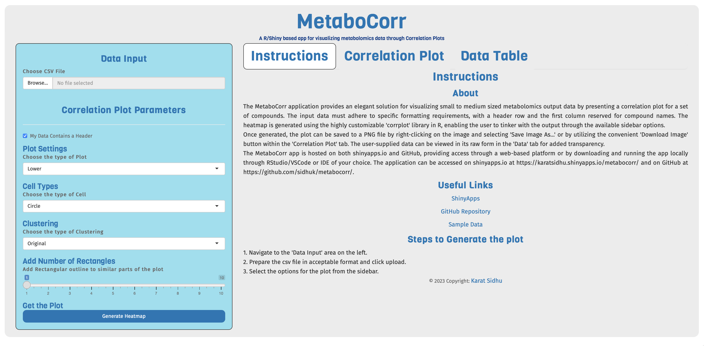
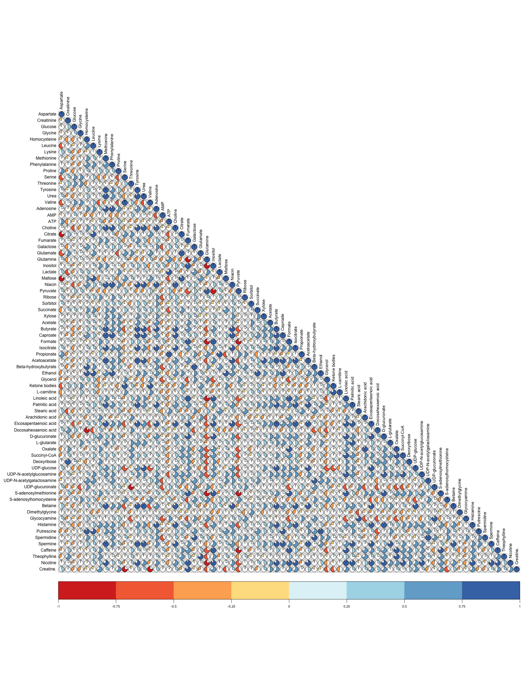
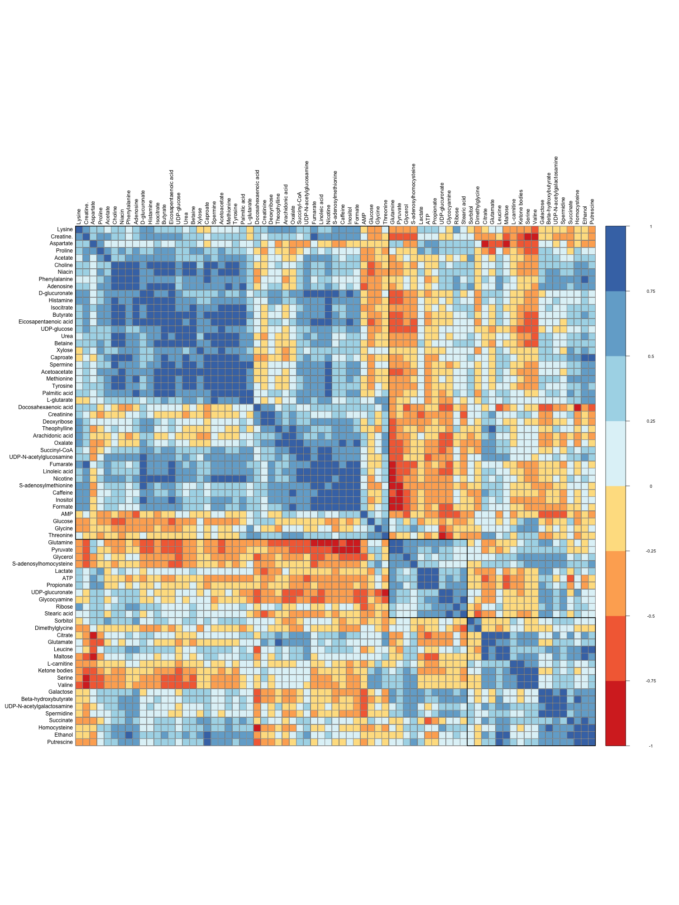

# MetaboCorr

## An R/Shiny based application for visualization of metabolomics data in the form of correlation matrices


Available online at [here](https://karat.shinyapps.io/MetaboCorr/) or locally using the source code in this repository.


_The Shiny App Home Page_

## Introduction

MetaboCorr is a R/Shiny based app for visualizing metabolomics data through correlation matrices. **It is designed specifically to be used for small to medium sized metabolomics datasets (<=500 compounds for best results)** .Ideally, the data is normalized and filtered before being used in the app. The app can be used in two ways:

1. **Online**: The app is available online at [here](https://karat.shinyapps.io/MetaboCorr/). The app is hosted on a free account and may be slow at times. The app is also limited to 25 concurrent users. If you are unable to access the app, please try again later, or contact me on [Twitter](https://twitter.com/karat_sidhu) or [Mastodon](https://mas.to/@karat) and I will try my best to resolve the issue.

2. **Locally**: The app can be run locally using the source code in this repository. Any IDE configured to run R/Shiny apps can be used.

## Example Heatmaps

 

## Features

This R/Shiny based app is designed to be used for visualizing metabolomics data through heatmaps. It is based on the [CorrPlot Package](https://github.com/taiyun/corrplot) and uses the [Shiny Package](https://shiny.rstudio.com/) to create a web app interface.
In its current release, the app has the following features:

- **Correlation Matrix Generation**: The app can be used to generate correlation matrices from metabolomics data.
- **Clustering**: The app can be used to cluster the samples and compounds/metabolites in the heatmap.
- **Corr Plot Variations**: The app can be used to select the type of correlation plot output.
- **Display Cell Values**: The app can be used to display the values corresponding to each cell in the heatmap.
- **Download Plot**: The app can be used to download the heatmap as a high quality PNG image.

Additionally, the app has some custom **CSS Formatting** to ensure it is responsive and can be used on any device with a web browser, including mobile devices, although desktops are recommended for best results.

## Data Preprocessing & Upload

Before starting the app, the data must be preprocessed and uploaded to the app.

### Data Preprocessing

The sample data provided in this repository and is a randomly generated dataset. The data is in the form of a comma-separated (CSV) text file and it is the only file format that is supported by the app for now.

The data must be in the following format:

- The first column must be named 'compound' and contain the names of the compounds/metabolites. The names of the compounds must be unique,
  and the column heading is case sensitive.

- The first row must be named 'sample' and contain the names of the samples. The names of the samples must be unique,

- The remaining cells must contain the values of the metabolites for each sample. _The values must be numeric._

- The data must be in a rectangular format. That is, the number of columns must be equal to the number of samples, and the number of rows must be equal to the number of compounds/metabolites.

- For best results, the data should be normalized and filtered before being used in the app. The app does not perform any normalization or filtering on the data. However, the app will carry out the correlation calculation on the data, and will display a warning if the data is not normalized and filtered.

### Data Upload

To upload the data, simply click on the 'Browse' button on the home page of the app. This will open a file selection dialog box. Select the data file and click 'Open'. The app will then load the data for visualization.

## Usage

Once the data is uploaded, you must then select the parameters for the plot. Once the parameters are selected, click on the 'Generate Plot' button to generate the chart. The plot generation could take from a few seconds to a few minutes depending on the size of the data and the parameters selected. Heatmap generated can be viewed and downloaded from the 'Correlation Plot' tab.

### Online App

The app is available online at [here](https://karat.shinyapps.io/MetaboCorr/). The app is hosted on a free account and may be slow at times. The app is also limited to 25 concurrent users. If you are unable to access the app, please try again later, or contact me on [Twitter](https://twitter.com/karat_sidhu) or [Mastodon](https://mas.to/@karat) and I will try my best to resolve the issue.

### Installation

#### To run the app locally:

1. Clone the repository using the following command:

```bash
git clone https://github.com/SidhuK/MetaboCorr
```

or download the repository as a zip file and extract it.

2. Open the project in RStudio or any other IDE configured to run R/Shiny apps.

3. Install the required packages using the following command:

```r
install.packages(c("shiny", "corrplot", "rcolorbrewer"))
```

4. Run the app using the following command:

```r
shiny::runApp()
```

5. The app will be available locally and can be accessed using the URL provided in the R console.

6. Once the app starts, upload the data and proceed according to the instructions in the Usage section.

7. To stop the app, press the 'Stop' button in the R console or simply close the R console.

## License

This project is licensed under the MIT License - see the [LICENSE](LICENSE) file for details. This license applies to the source code of the app only. The data used in the app is randomly generated and is not licensed. The data is provided for demonstration purposes only, and should not be used for any other purpose.

## Acknowledgments

The app uses the following packages:

- [Shiny](https://shiny.rstudio.com/)
- [RColorBrewer](https://cran.r-project.org/web/packages/RColorBrewer/index.html)
- [CorrPlot](https://github.com/taiyun/corrplot)

## Citation

If you use this app in your research, please use the following citation:

```bibtex

@software{karat_sidhu_2023_7631526,
  author       = {Karatatiwant Singh Sidhu},
  title        = {SidhuK/metabocorr: Version 1.0},
  month        = feb,
  year         = 2023,
  publisher    = {Zenodo},
  version      = {1.0},
  doi          = {10.5281/zenodo.7631526},
  url          = {https://doi.org/10.5281/zenodo.7631526}
}

```

### Planned Features

This app is still in development and is not yet complete. The following features are planned for future releases:

- [ ] Annotations
- [ ] Font Size
- [ ] More Color Schemes

The list of planned features is not exhaustive and may be updated at any time.

## Contact

If you have any questions or suggestions, please contact me on [Twitter](https://twitter.com/karat_sidhu) or [Mastodon](https://mas.to/@karat). You can also open an issue on the [GitHub Repository](https://github.com/sidhuK/metabocorr).
